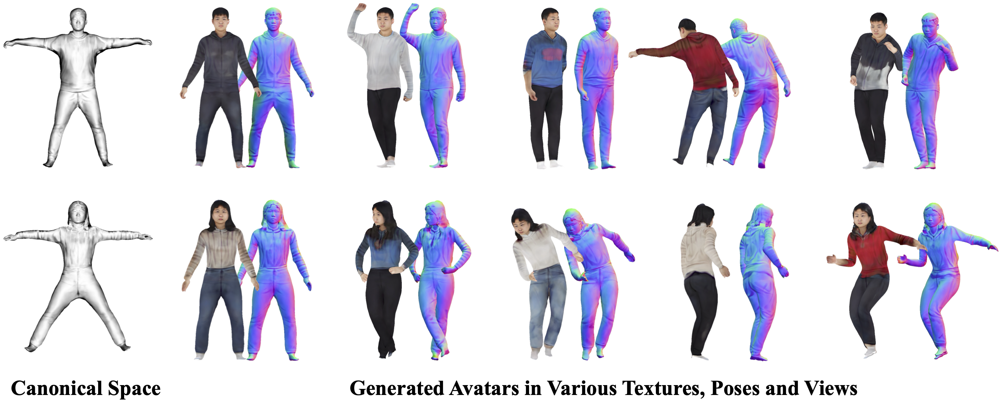

# HQ-Avatar: Towards High-Quality 3D Avatar Generation via Point-based Representation
## [Paper](https://ieeexplore.ieee.org/document/10688199) | [Project Page]() 


Official implentation of ICME 2024 paper [*HQ-Avatar: Towards High-Quality 3D Avatar Generation via Point-based Representation*](https://ieeexplore.ieee.org/document/10688199).

## preprocess
```bash
CUDA_VISIBLE_DEVICES=0 python preprocess.py --tot 4 --id 0
```

## Training
Run the following command to train the model in two stage:
```bash
# train coarse
python train.py expname=gdna_addtex_coarse datamodule=thuman

# precompute for training fine
CUDA_VISIBLE_DEVICES=0 python precompute.py expname=gdna_addtex_coarse datamodule=thuman agent_tot=4 agent_id=0

# train fine
python train.py expname=gdna_addtex_fine datamodule=thuman +experiments=fine model.norm_network.multires=6 model.tex_network.multires=6 starting_path='./outputs/gdna_addtex_coarse/checkpoints/last.ckpt'
```

This repo is still under construction and will be refined soon.(in one week)